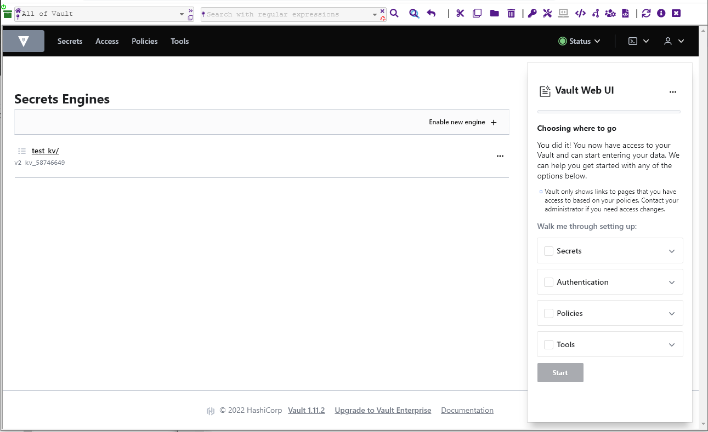
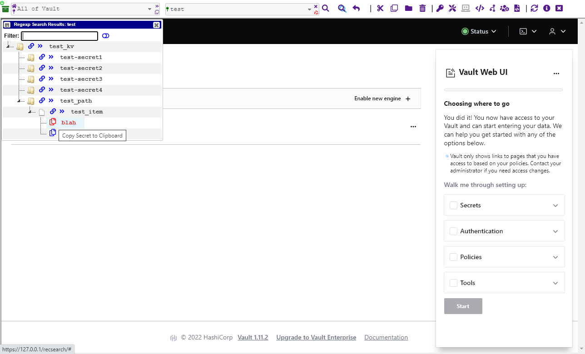
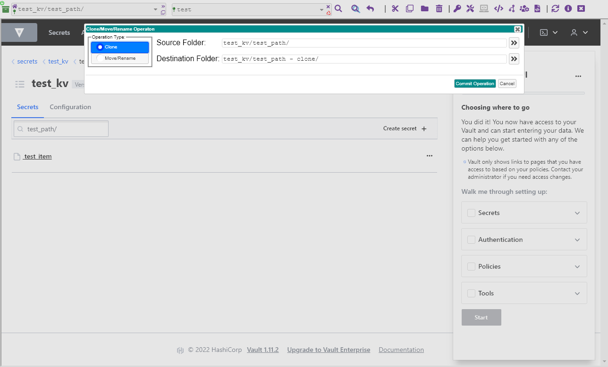
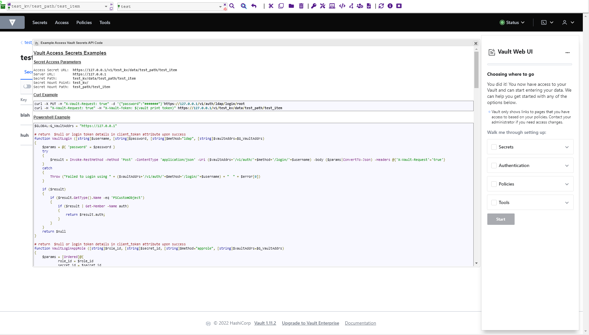

# vault_recursive_gui
<a href="https://github.com/sdetoni/vault_recursive_gui">HasiCorp Vault Recursive GUI overlay</a>

The project implements a GUI over the top of the built in Vault GUI.
It does this using a reverse web proxy, and wedges in the Vault GUI using an I-Frame.
The vault_recursive_gui uses standard Vault API calls to recursively search a Vault 
repository on KV2 type secret mount points. Results returned are based upon the logged in user's policies.
Once Vault secrets are returned or pre-cached, they're stored locally in the client
web browser's memory in an encrypted form using AES-CTR encryption, and a randomly generated key.

In addition to recursive searching, this GUI provides:
   - cut and paste of Vault items and directories.
   - rename and moving of vault items and directories.
   - pin search history.
   - regular expressions in searching.
   - secret password generator.
   - export and import of secrets using json file format.
   - root token generator and revoker.
   - programmer example code to access secret items in PowerShell.
   
The project contains an example Vault setup that implements the GUI overly.
It uses 2 dependent pieces of software: 
   Caddy  : A reverse proxy to handle web server, and reverse proxy to the Vault daemon.
   NodeJS : NodeJS server to handle bulk downloading for very large Vault secret databases. 
   
Note: The example Vault secret database in this project should NEVER EVER be used in an production environment without changing unseal keys and the root token!

All API code is written in Javascript and JQuery.

-------------------------------------------------------------------------------------------

Example Software Stack
----------------------

Download NodeJS, Caddy, and Vault:
- NodeJS    https://nodejs.org/dist/v16.17.0/node-v16.17.0-win-x64.zip
- Caddy     https://caddyserver.com/download
- Vault     https://releases.hashicorp.com/vault/1.12.1/vault_1.12.1_windows_amd64.zip
       
Review boot.cmd to see boot sequence:
  - refer to file **vault-recovery-keys-root-token.json** for **root_token**
  - Once services have booted, access vault via **https://127.0.0.1** 
  - Login using method **token** and paste in the token password

-------------------------------------------------------------------------------------------

Caddyfile Reverse Proxy:
    Take note of the Caddyfile that overrides a header to handle restrictions.
    This is so it can implement an i-frame from the same server.
    
```caddy    
    # override vault about iframe restrictions and allow it for from the same server.
    header {
    }
    
    reverse_proxy  https://127.0.0.1:8200 {
        
        # Update  header Content-Security-Policy from proxy return, replace it with the one in header override
        # original header:  content-security-policy "default-src 'none'; connect-src 'self'; img-src 'self' data:; script-src 'self'; style-src 'unsafe-inline' 'self'; form-action  'none'; frame-ancestors 'none'; font-src 'self'"
        header_down   content-security-policy  "default-src 'none'; connect-src 'self'; img-src 'self' data:; script-src 'self'; style-src 'unsafe-inline' 'self'; form-action  'none'; frame-ancestors 'self'; font-src 'self'"
    }    
```
-------------------------------------------------------------------------------------------
       
## Web Client Debug Mode
Press F12 (Chrome or Firefox) to enter debug mode, and select the Console tab to view Javascript information.

## Screenshots










## Vault Raft Proxy Caddy Config
[raft_proxy_caddy.txt](src/raft_config/raft_proxy_caddy.txt)

## Why 'Vault Recursive GUI'?
Vault Recursive GUI does not replace the standard Vault GUI, it adds to it. 
This means future Vault features will not be missed; other custom Vault GUI's would need to code these change independently.
